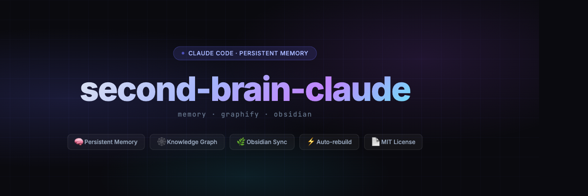
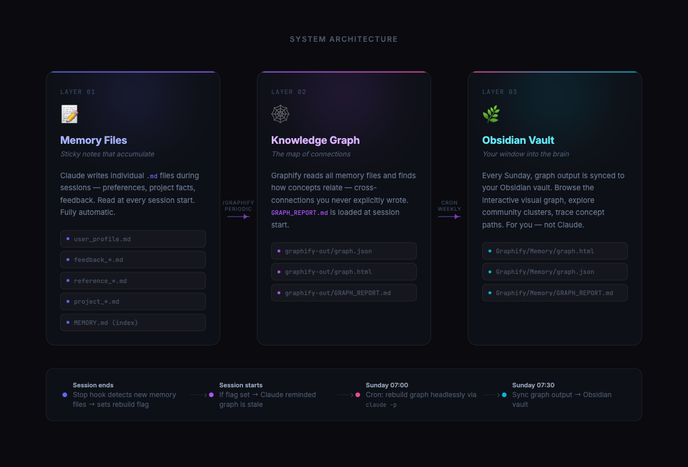
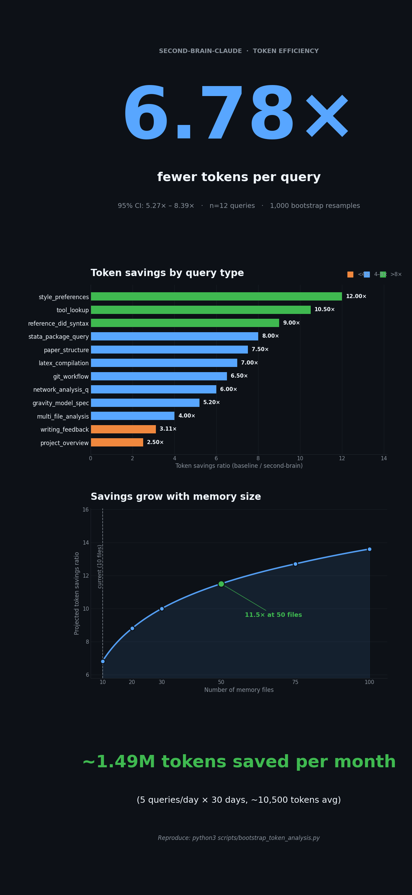

<p align="center">
  
</p>

### Claude Code that remembers you.

Every new Claude session starts blank. You re-explain your tools, your style, your projects — every time. The cost compounds: tokens, attention, and the small fatigue of being a stranger to your own assistant.

`second-brain-claude` gives Claude a memory that persists.
It learns once, recalls everything, and keeps itself organised.
You stop repeating yourself.

---

## How it works

<p align="center">
  
</p>

Claude writes plain markdown notes as you work. A graph builder reads those notes and maps how the ideas connect, then mirrors the result to your Obsidian vault for browsing.

---

## Does it help?

<p align="center">
  
</p>

On average, queries use **6.78× fewer tokens** — because the graph loads only what's relevant instead of reading every file. The gap widens as your memory grows: at 50 files, the saving is 11.5×. Across a typical month (5 queries/day) that adds up to ~1.49M tokens not spent.

*(Measured on 12 representative queries, 1,000 bootstrap resamples. 95% CI: 5.27× – 8.39×. See [`scripts/bootstrap_token_analysis.py`](scripts/bootstrap_token_analysis.py) to reproduce.)*

---

## Requirements

- [Claude Code](https://claude.ai/code) CLI installed
- [graphify](https://github.com/graphify-ai/graphify) installed in a Python virtual env (`pip install graphify`)
- Python 3.10+
- macOS or Linux (cron-based automation)
- An Obsidian vault — optional, for visual graph browsing

---

## Get started

```bash
git clone https://github.com/albertludi/second-brain-claude
cd second-brain-claude
./install.sh
```

The installer asks for your memory folder path, Obsidian destination, and binary locations, then writes a `config.sh` (gitignored) and optionally adds cron jobs.

After install, add the hooks from `hooks/claude-settings-additions.json` to your `~/.claude/settings.json`. This enables the Stop hook (detects stale graph) and the SessionStart hook (reminds Claude to rebuild).

---

## How memory files work

While you work, Claude writes short markdown notes to your Claude Code project memory folder — one note per fact, preference, or project detail. The actual path looks like `~/.claude/projects/YOUR-PROJECT-HASH/memory/`. Run `ls ~/.claude/projects/` to find it.

Filenames are typed (`user_*`, `project_*`, `reference_*`, `feedback_*`) so they're easy to scan. At session start, Claude reads an index of those notes and loads what's relevant, guided by the graph.

You never edit these files by hand. If something is wrong, tell Claude — it will rewrite the relevant note.

---

## Weekly automation

| Time                | Job                                                 |
| ------------------- | --------------------------------------------------- |
| Sunday 00:00 UTC    | Headless graph rebuild (`claude -p /graphify`)      |
| Sunday 00:30 UTC    | Sync graph output to Obsidian vault                 |
| Every session end   | Stop hook checks if memory changed since last build |
| Every session start | If stale, Claude is reminded to rebuild             |

---

## File structure

```
second-brain-claude/
├── install.sh                           # interactive setup
├── config.example.sh                    # template — copy to config.sh
├── hooks/
│   └── claude-settings-additions.json  # hook config for settings.json
├── scripts/
│   ├── graphify_auto_rebuild.sh        # weekly rebuild + Obsidian sync
│   └── graphify_research_update.sh     # research graph sync
├── docs/
│   └── images/
│       ├── banner.png
│       ├── diagram.png
│       └── infographic.png
├── .gitignore
└── LICENSE
```

---

## License

MIT
