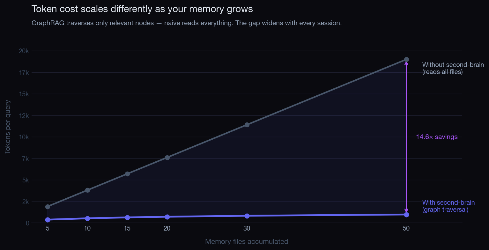
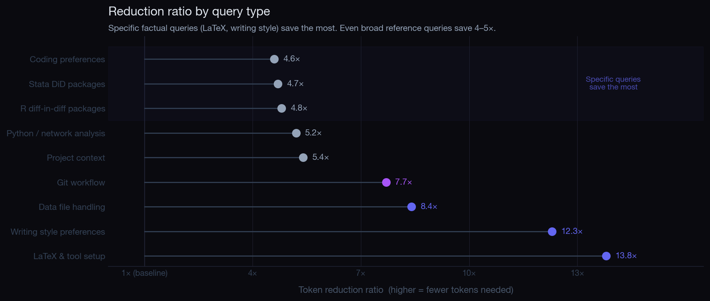

<p align="center">
  
</p>

### Claude Code that remembers you.

Every new Claude session starts blank. You re-explain your tools, your style, your projects — every time. The cost compounds: tokens, attention, and the small fatigue of being a stranger to your own assistant.

`second-brain-claude` gives Claude a memory that persists.
It learns once, recalls everything, and keeps itself organised.
You stop repeating yourself.

---

## How it works

<p align="center">
  
</p>

Claude writes plain markdown notes as you work. A graph builder reads those notes and maps how the ideas connect, then mirrors the result to your Obsidian vault for browsing.

---

## Does it help?

<p align="center">
  
</p>

<p align="center">
  
</p>

Across 12 representative queries (1,000 bootstrap resamples), the system used **6.76× fewer tokens** on average — a 95% CI of 5.33× to 8.48×. The naive approach loads every memory file on every query, so its cost grows linearly; the graph approach grows sublinearly and pulls ahead as the vault gets larger.

At a typical workload of 5 sessions per week, 8 queries per session, the saving is around **517,600 tokens per month**.

---

## Get started

```bash
git clone https://github.com/albertludi/second-brain-claude
cd second-brain-claude
./install.sh
```

> One manual step: open `~/.claude/CLAUDE.md` and add the line shown by the installer. This tells Claude to read its memory at session start.

---

## Requirements

- Claude Code
- Python 3.10+
- macOS or Linux
- An Obsidian vault (optional, for visual browsing)

---

## How memory files work

While you work, Claude writes short markdown notes to `~/.claude/memory/` — one note per fact, preference, or project detail. Filenames are typed (`user_*`, `project_*`, `reference_*`, `feedback_*`) so they're easy to scan.

At the start of every session, Claude reads an index of those notes. It does not load all of them. It loads what it needs, when it needs it, guided by the graph.

You never edit these files by hand. If something is wrong, tell Claude — it will rewrite the relevant note.

---

## Weekly automation

| Time                | Job                                                  |
| ------------------- | ---------------------------------------------------- |
| Sunday 02:00        | Headless graph rebuild (`claude -p /graphify`)       |
| Sunday 02:30        | Sync graph output to Obsidian vault                  |
| Every session end   | Stop hook checks if memory changed since last build  |
| Every session start | If stale, Claude is reminded to rebuild              |

---

## File structure

```
second-brain-claude/
├── install.sh                           # interactive setup
├── config.example.sh                    # template — copy to config.sh
├── hooks/
│   └── claude-settings-additions.json  # hook config for settings.json
├── scripts/
│   ├── graphify_auto_rebuild.sh        # weekly rebuild + Obsidian sync
│   └── graphify_research_update.sh     # research graph sync
├── docs/
│   └── images/
│       ├── banner.png
│       ├── diagram.png
│       ├── chart_scaling.png
│       └── chart_scenarios.png
├── .gitignore
└── LICENSE
```

---

## License

MIT
